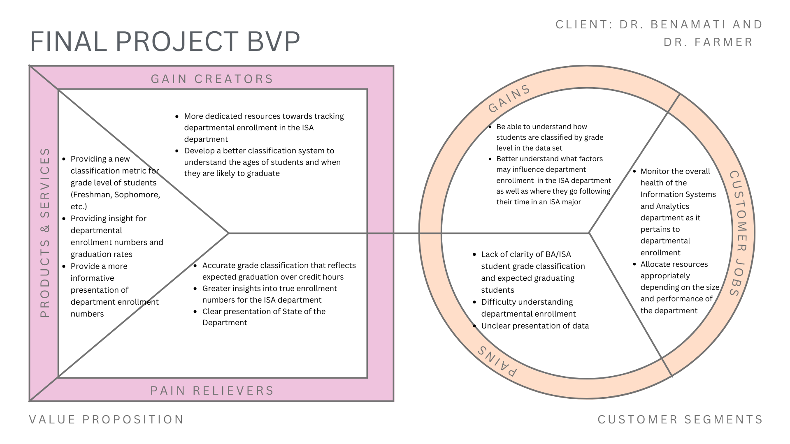

```{r setup, include=FALSE}
knitr::opts_chunk$set(echo = TRUE)
if(require(pacman)==FALSE) install.packages("pacman")
pacman::p_load(DataExplorer, # For explorer and cleaning data by visualizing missing values.
               httr, # For downloading the data from the UCI
               tidyverse, # For data manipulation
               corrplot, # for heatmaps
               DataExplorer, #for exploring data
               skimr, # for nice summary of data
               readxl, #to read Excel files
               networkD3 # to create a Sankey Plot
               ) # For creating dummy variables of categorical variables automatically.)
library(dplyr)
```

# Problem Statement
The ISA department has multiple classes of students each year. However, each year the number of students who graduate as seniors with their undergraduate does not align with the number of students in the major the previous year. Our primary goal with this project is to restructure and classify the students in a way that the department can accurately anticipate for the correct number of graduates the year before. Secondly, along with graduation, we have been asked to research the data and understand where these students are going, what are the leading causes of students leaving, and to redesign the classification metrics for grade level.

# Research Questions
* What is the best way to classify student grade levels? Number of credit hours? Full semesters at Miami?
* Why are there fewer graduating seniors than estimated each year, and what is the cause for this drop-off?
  * Where are these students going?
* Are there indicators that can show when we estimate a student is about to graduate? We can look at number of credit hours, semesters at Miami, course performance and more.

# Business Value Proposition
```{r, echo=FALSE}

```

## Customer Jobs

Our client for this project is the Information Systems and Analytics department at Miami, but more specifically, Dr. Benamati and Dr. Farmer. These two have a very important role in the ISA department to monitor the health of the organization and to appropriate allocate resources based on needs.

### Monitor the Overall Health of the Information Systems and Analytics Department as it Pertains to Departmental Entrollment

As the chairs of the department, Dr. Benamati and Dr. Farmer are tasked with monitoring the overall health and performance of the Information Systems and Analytics department. This can include monitoring departmental enrollment as it pertains to showing the amount of students who enter into ISA majors as freshmen, retention within the department, and ultimately, how many students graduate with a degree from the department. This health ultimately helps Dr. Benamati and Dr. Farmer argue for the case of the ISA department during the State of the Department and can help the department grow over time.

### Allocate Resources Appropriately Depending on the Size and Performance of the Department

Based on the health that is monitored from the department, Dr. Benamati and Dr. Farmer are tasked with allocating resources appropriately. This can include increasing the number of professors or course sections offered depending on the amount of ISA majors that are enrolled. 

## Customer Pains

### Lack of Clarity of BA/ISA Student Grade Classification and Expected Graduating Students
Student classification of grades has led to inaccurate data regarding the number of expected graduates. 

### Difficulty Understanding Departmental Enrollment
Due to misclassifications and other factors, there are inaccuracies that misrepresent the true enrollment of the ISA department

### Unclear Presentation of Data
The current table that is used to present enrollment data can be confusing and inaccurate.

## Customer Gains

### Be Able to Understand How Students are Classified as Freshmen, Sophomores, etc. in the Data Set
With the current data set, the current classification of grades has led to inaccurate data reporting when it comes to anticipating the number of graduates within the data set.

### Better Understand what Factors May Influence Departmental Enrollment in the ISA Department as Well as Where they Go if they Change their Major
Within the current data set, there is no way to estimate when a student is about to exit the ISA department, whether that be because they are about to graduate or because they are changing their major. Thus, it makes it difficult for the ISA department to allocate their resources to maximize student benefit.

## Products and Services

### Providing a New Classification Metric for Grade Level of Students (Freshman, Sophomore, etc.)
Take more factors into account to better determine expected graduation of students. Current method of classification by number of credit hours does not best reflect student year and expected graduation.

### Providing Insight for Departmental Enrollment Numbers and Graduation Rates
Better indicate when a student is about to graduate from the ISA department so that resources can be allocated effectively.

### Providing a More Informative Presentation of Department Enrollment Numbers
The current matrix visual within the State of the Department Presentation can be hard for a non-analytical audience to read to understand the enrollment numbers problem easily.

## Pain Relievers

### Accurate Grade Classification that Reflects Expected Graduation
With the current state of the data, the actual number of graduating seniors is less than the anticipated amount in the previous year. Through our work, we seek to relieve this pain to account for anticipated early graduations, transfers, etc. We also seek to find a better way to classify student grades rather than solely by number of credit hours taken.

### Greater Insights Into True Enrollment Numbers for the ISA Department
Through our solution, we will provide the ISA department with a more accurate reporting for the ISA department so that they are able to allocate resources and budget effectively for the upcoming year.

### Clear Presentation of the State of the Department
Through our solution, we will prepare a more effective presentation of the ISA department's numbers in the State of the Department presentation. This information will be well organized in a way that those who do not have a strong background in analytics are still able to obtain valuable insights.

## Gain Creators

### More Dedicated Resources Towards Retaining Students in the ISA Department
Our solution will give the ISA department the information they need to better plan for the upcoming year by providing estimates of the number of students that will come through the department and eventually graduate each year. This will allow both Dr. Benamati and Dr. Farmer to spend less time on this administrative task and instead on preparing for the longevity of the department.

### Better Classification System to Understand the Ages of Students and When They Are Likely to Graduate
Our solution will provide the ISA department with a better system to classify students by their grade level so they can better understand and predict the number of students who will graduate from the department.

# Timeline for Completion

1. Draft of Problem Statement - 
Due with checkpoint 1 materials on November 4th. Responsible stakeholder: Nick Oakley.

2. Develop Research Questions - 
Due with checkpoint 1 materials on November 4th. Responsible stakeholder: Andrew Edwards.

3. Business Value Propositions - 
Due with checkpoint 1 materials on November 4th. Responsible stakeholder: Lauren Pagel.

4. Upload Data into Document - 
Do by the EOD on November 5th after class. Responsible stakeholder: Andrew Edwards, Nick Oakley, Lauren Pagel.

5. Clean Dataset - 
Work on in class on November 5th and 7th, finish by November 10th. Responsible stakeholder: Andrew Edwards, Nick Oakley, Lauren Pagel.

6. Merge Datasets Together - 
Turned in with Project #2 Checkpoint on 11/17. Responsible stakeholder: Andrew Edwards, Nick Oakley, Lauren Pagel.

7. Develop Metric to Count the Number of Students for Each Grade Level - 
Work on during class on 11/19 and 11/21. Responsible stakeholder: Andrew Edwards, Nick Oakley, Lauren Pagel.

8. Begin Building Visualizations - 
Build out by the end of the week on 11/22. Responsible stakeholder: Andrew Edwards, Nick Oakley, Lauren Pagel.

9. Draft of Final Presentation Slides - 
Have draft done by 11/26 before Thanksgiving Break. Responsible stakeholder: Andrew Edwards, Nick Oakley, Lauren Pagel.

10. Draft Technical Report - 
Have draft done by 11/26 before Thanksgiving Break. Responsible stakeholder: Andrew Edwards, Nick Oakley, Lauren Pagel.

11. Revise Technical Report - 
Finish revisions by 12/3. Responsible stakeholder: Andrew Edwards, Nick Oakley, Lauren Pagel.

12. Revise Final Presentation Slides - 
Finish revisions by 12/3. Responsible stakeholder: Andrew Edwards, Nick Oakley, Lauren Pagel.

13. Submit Final Slides and Technical Report - 
Submit by EOD December 5th. Responsible stakeholder: Andrew Edwards, Nick Oakley, Lauren Pagel.

14. Deliver Final Presentation - 
Present week of December 3rd. Responsible stakeholder: Andrew Edwards, Nick Oakley, Lauren Pagel.

# Deliverables

## Full Technical Report

This report will be submitted by 11:59pm on December 5th. This report will detail information about our data, cleaning process, results, and limitations of the data. The goal of this report is to explain our processes in a way that provides explicit clarity and resembles the characteristics of a reproducible data analysis.

## Presentation Slides

Another aspect of our project that we will deliver are our presentation slides, as well as our presentation. These will also be due by 11:59pm on December 5th, although our presentation may fall earlier. The goal of this presentation is to clearly articulate our findings to our audience and visualize the data in a way that is easy for someone with a non-technical background to understand.

## Reproducible Data Analysis

Along with our technical report and presentation, we will also submit a fully reproducible data analysis. This is so that as more students come through the department, this analysis will be able to rerun for new sets of students.

# Analysis
## BA Majors

### Counts of BA Students Across Cohort and Term Code
To begin our analysis, I am interested in looking at the raw counts of students enrolled in the BA major across different cohort terms and term codes in which they are enrolled at Miami. This code will filter my table for students who have BA Major indicated for at least one of their majors across different semesters for students in a particular cohort term. Below is our code output. Moving forward with analysis, I would be interested in showing how the number of students who graduated each semester could be implemented with this as we work to reclassify students. In addition, numbers from this table could be used to track student movement through various majors, should they change their major away from Business Analytics.
```{r, echo=FALSE}
BA = read.csv('data-clean/BA_Final.csv')
result <- BA |>
  dplyr::filter(`Major.1` == "BA Major" | `Major.2` == "BA Major" | `Major.3` == "BA Major") |>
  dplyr::group_by(`Cohort.Term`, `Term.Code`) |>
  dplyr::summarize(Num_Students = n_distinct(`Student.ID`), .groups = 'drop')


# Display the reshaped table
print(result)

```

### Graduation Counts for BA Majors by Academic Year
To provide ourselves with a good baseline before doing any further analysis, we want to generate an overarching graph that shows the number of students who have graduated for each academic year:
```{r, echo=FALSE}
# Determine the maximum Term.Code for each Student.ID to identify the graduation term
graduation_terms <- BA |>
  dplyr::group_by(`Student.ID`) |>
  dplyr::summarize(Max_Term_Code = max(`Term.Code`), .groups = 'drop')

# Filter the original data to only include rows where the Term.Code is the graduation term
graduated_students <- BA |>
  dplyr::inner_join(graduation_terms, by = c("Student.ID" = "Student.ID", "Term.Code" = "Max_Term_Code")) |>
  dplyr::filter(
    `Term.Code.Graduated` == `Term.Code`,
    `Major.1` == "BA Major" | `Major.2` == "BA Major" | `Major.3` == "BA Major"
  )

# Count the number of students who graduated each semester for each Term.Code
result <- graduated_students |>
  dplyr::group_by(`Term.Code`) |>
  dplyr::summarize(Num_Graduated = dplyr::n_distinct(`Student.ID`), .groups = 'drop')

# Create a mapping of Term.Code to academic year and term type
result <- result |> 
  dplyr::mutate(
    Academic_Year = dplyr::case_when(
      Term.Code %in% c(202510, 202520) ~ "2024-2025",
      Term.Code %in% c(202410, 202420) ~ "2023-2024",
      Term.Code %in% c(202310, 202320) ~ "2022-2023",
      Term.Code %in% c(202210, 202220) ~ "2021-2022",
      Term.Code %in% c(202110, 202120) ~ "2020-2021",
      Term.Code %in% c(202010, 202020) ~ "2019-2020",
      Term.Code %in% c(201910, 201920) ~ "2018-2019",
      Term.Code %in% c(201810, 201820) ~ "2017-2018",
      TRUE ~ as.character(Term.Code)  # Default case if needed
    ),
    Term_Type = dplyr::case_when(
      stringr::str_ends(as.character(Term.Code), "10") ~ "Fall",
      stringr::str_ends(as.character(Term.Code), "20") ~ "Spring",
      TRUE ~ "Unknown"
    )
  ) |>
  dplyr::mutate(Term_Type = factor(Term_Type, levels = c("Spring", "Fall")))

# Create a stacked bar plot
ggplot2::ggplot(result, ggplot2::aes(x = Academic_Year, y = Num_Graduated, fill = Term_Type)) + 
  ggplot2::geom_bar(stat = "identity") + 
  ggplot2::geom_text(ggplot2::aes(label = Num_Graduated), position = ggplot2::position_stack(vjust = 0.5), size = 3.5) + 
  ggplot2::labs(
    title = "Number of BA Major Graduates by Term Code",
    x = "Academic Year",
    y = "Number of Graduates",
    fill = "Term Type"
  ) + 
  ggplot2::theme_minimal() + 
  ggplot2::scale_fill_manual(values = c("Fall" = "#ADD8E6", "Spring" = "#0047AB")) + # Custom colors for Fall and Spring
  ggplot2::theme(
    plot.title = ggplot2::element_text(hjust = 0.5)  # Center the title
  )
```

This chart provides me with the number of graduation numbers the Business Analytics major has seen as a whole in the past 8 academic years. In general, here, I can see that most students with Business Analytics majors graduate in the spring semester as opposed to the fall. In addition, I am able to see how the department has improved as a whole in the past 8 academic years to increase the number of students who graduated with a degree in Business Analytics

### Graduation Counts for BA Majors - by Cohort and Term Code
This preliminary analysis shows the number of students from each cohort term who graduated each semester. From first looks, I notice that most students graduate during the spring of their senior year. This table, with the knowledge of the data we have, also indicates that there tends to be relatively few exceptions to this rule - as a significantly smaller number of students ten to graduate during the fall term, and few also graduate a full year early or late than their peers in their cohort term.
```{r, echo =FALSE}
# Determine the maximum Term.Code for each Student.ID to identify the graduation term
graduation_terms <- BA |>
  dplyr::group_by(`Student.ID`) |>
  dplyr::summarize(Max_Term_Code = max(`Term.Code`), .groups = 'drop')

# Filter the original data to only include rows where the Term.Code is the graduation term
graduated_students <- BA |>
  dplyr::inner_join(graduation_terms, by = c("Student.ID" = "Student.ID", "Term.Code" = "Max_Term_Code")) |>
  dplyr::filter(
    `Term.Code.Graduated` == `Term.Code`,
    `Major.1` == "BA Major" | `Major.2` == "BA Major" | `Major.3` == "BA Major"
  )

# Count the number of students who graduated each semester for each Term.Code
result <- graduated_students |>
  dplyr::group_by(`Cohort.Term`, `Term.Code`) |>
  dplyr::summarize(Num_Graduated = dplyr::n_distinct(`Student.ID`), .groups = 'drop')

result
```
Let's more closely take at those who graduated last spring:

```{r, echo=FALSE}
# Determine the maximum Term.Code for each Student.ID to identify the graduation term
graduation_terms <- BA |>
  dplyr::group_by(`Student.ID`) |>
  dplyr::summarize(Max_Term_Code = max(`Term.Code`), .groups = 'drop')

# Filter the original data to only include rows where the Term.Code is the graduation term
graduated_students <- BA |>
  dplyr::inner_join(graduation_terms, by = c("Student.ID" = "Student.ID", "Term.Code" = "Max_Term_Code")) |>
  dplyr::filter(
    `Term.Code.Graduated` == `Term.Code`,
    `Major.1` == "BA Major" | `Major.2` == "BA Major" | `Major.3` == "BA Major"
  )

# Count the number of students who graduated each semester for each Term.Code
result <- graduated_students |>
  dplyr::group_by(`Cohort.Term`, `Term.Code`) |>
  dplyr::summarize(Num_Graduated = dplyr::n_distinct(`Student.ID`), .groups = 'drop')|>
  dplyr::filter(`Term.Code` == 202420)


# Display the distribution in a formatted table with a colored header
knitr::kable(result, col.names = c("Cohort Term", "Term Code", "Number of Graduates"), caption = "Spring 2024 Graduates") |>
  kableExtra::kable_styling(
    bootstrap_options = c("striped", "hover", "condensed"),
    full_width = FALSE,
    position = "center"
  ) |>
  kableExtra::column_spec(1) |>
  kableExtra::column_spec(2) |>
  kableExtra::column_spec(3) |>
  kableExtra::row_spec(0, background = "#ADD8E6")  # Light gray header
```

The term code of 202420 indicates to Spring Semester 2024. As shown by this data, we had 44 total students who graduated with a major in Business Analytics for this term, which matches the number from our graph previously. 

What's interesting about this table is that it is broken down by the cohort term in which students started at Miami. We can see that most of the graduates came from Cohort Term 202110, which refers to students who started their college careers in the fall of 2020. If a student started their college career at this time and followed the traditional trajectory, we would expect them to graduate in the spring of 2024. While there are a couple of exceptions to this rule, showing students who may have taken a 5th or gap year, as well as one student who graduated a year early, most of the Business Analytics majors in the dataset appear to be graduating based on the amount of time they have spent at Miami.

To validate this assumption, let's show the distribution of number of semesters it takes for students to graduate:
```{r, echo=FALSE}
# Identify students who have graduated
graduated_students <- BA |>
  dplyr::group_by(`Student.ID`) |>
  dplyr::filter(max(`Term.Code`) == `Term.Code.Graduated`) |>
  dplyr::ungroup()

# Count the number of unique Term.Code entries for each Student.ID
semester_counts <- graduated_students |>
  dplyr::group_by(`Student.ID`) |>
  dplyr::summarize(Semester_Count = dplyr::n_distinct(`Term.Code`), .groups = 'drop')

# Summarize the distribution of semester counts
distribution <- semester_counts |>
  dplyr::group_by(Semester_Count) |>
  dplyr::summarize(Num_Students = dplyr::n(), .groups = 'drop')

# Calculate the total number of students
total_students <- sum(distribution$Num_Students)

# Add a percentage column
distribution <- distribution |>
  dplyr::mutate(Percentage = (Num_Students / total_students) * 100)

# Display the distribution in a formatted table with a colored header
knitr::kable(distribution, col.names = c("Number of Semesters", "Number of Students", "% of Total"), caption = "Distribution of Semesters to Graduation") |>
  kableExtra::kable_styling(
    bootstrap_options = c("striped", "hover", "condensed"),
    full_width = FALSE,
    position = "center"
  ) |>
  kableExtra::column_spec(1) |>
  kableExtra::column_spec(2) |>
  kableExtra::column_spec(3) |>
  kableExtra::row_spec(0, background = "#ADD8E6")  # Light gray header
```
With the current distribution of values within our data set, I can see that 80.13% of graduated students with a major in Business Analytics took 8 semesters to complete their degree. The next closest percentage is 7 semesters, which comes in around 10.10%. While there are certainly cases of students taking more or less time to graduate with their degree, the distribution of this data set leads me to believe that we should proceed by classifying student grade levels based upon the number of semesters of enrollment.

### Count of Student Grade Classification by Credit Hours
Before we examine the possibility of classifying students as per the number of semesters they have completed at Miami, let's first take a look into our data to see what the distribution of the number of credit hours students complete when they graduate.

```{r, echo=FALSE}

# Step 1: Identify the maximum Term.Code for each student
BA <- BA %>%
  group_by(Student.ID) %>%
  mutate(max_term_code = max(Term.Code)) %>%
  ungroup()

# Step 2: Identify graduated students by comparing Term.Code.Graduated to their max Term.Code
BA <- BA %>%
  mutate(graduated = ifelse(Term.Code == Term.Code.Graduated & Term.Code == max_term_code, TRUE, FALSE))

# Step 3: Filter for students who have graduated and capture their cumulative credit hours at graduation
graduated_students <- BA %>%
  filter(graduated == TRUE) %>%
  select(Student.ID, Cum.Credit.Hrs)

# Step 4: Visualize the distribution of cumulative credit hours at graduation
library(ggplot2)

# Plot the distribution of cumulative credit hours at graduation
ggplot(graduated_students, aes(x = Cum.Credit.Hrs)) +
  geom_histogram(binwidth = 5, color = "black", fill = "#ADD8E6", alpha = 0.7) +
  labs(
    title = "Distribution of Cumulative Credit Hours at Graduation",
    x = "Cumulative Credit Hours",
    y = "Number of Students"
  ) +
  theme_minimal()
```

As shown by this graph, students will graduate from Miami University with a wide variety of cumulative credit hours completed. This data could somewhat be impacted by how many transfer credits that a student has from high school, their number of majors and minors, and potentially if they want to be CPA eligible. Below we will detail some further statistics regarding those in our data set who have graduated with a Business Analytics Degree.
```{r, echo=FALSE}
# Step 1: Filter for graduated students and ensure non-missing credit hours
graduated_students <- BA %>% 
  filter(graduated == TRUE & !is.na(Cum.Credit.Hrs))  # Only include graduated students with valid credit hours

# Step 2: Calculate the min, mean, and max number of Cum.Credit.Hrs for graduated students
graduation_stats <- graduated_students %>%
  summarise(
    min_credit_hours = min(Cum.Credit.Hrs, na.rm = TRUE),
    mean_credit_hours = mean(Cum.Credit.Hrs, na.rm = TRUE),
    max_credit_hours = max(Cum.Credit.Hrs, na.rm = TRUE)
  )

# Rename the columns before using kable
colnames(graduation_stats) <- c("Minimum Credit Hours", "Mean Credit Hours", "Maximum Credit Hours")

# Create the table with customized headers and styling
knitr::kable(graduation_stats, caption = "Graduated Students' Cumulative Credit Hours Statistics") %>%
  # Apply bold styling to the header row and change background color
  kableExtra::kable_styling(
    bootstrap_options = c("striped", "hover", "responsive"),
    full_width = F
  ) %>%
  kableExtra::column_spec(1:3, bold = TRUE) %>%  # Make header titles bold
  kableExtra::row_spec(0, background = "#ADD8E6")  # Change background color of the header row (light blue)
```
```{r, echo=FALSE}
# Assuming your data frame is named 'student_data'
result <- BA |>
  dplyr::group_by(Student.ID) |>
  dplyr::filter(Term.Code == min(Term.Code)) |>
  dplyr::ungroup() |>
  dplyr::summarise(
    min_credit_hrs = min(Cum.Credit.Hrs),
    median_credit_hrs = median(Cum.Credit.Hrs),
    max_credit_hrs = max(Cum.Credit.Hrs)
  )

# Create the table with customized headers and styling
knitr::kable(result, caption = "Cumulative Credit Hours Statistics for First Term") |>
  kableExtra::kable_styling(
    bootstrap_options = c("striped", "hover", "responsive"),
    full_width = FALSE
  ) |>
  kableExtra::column_spec(1:3, bold = TRUE) |>  # Make header titles bold
  kableExtra::row_spec(0, background = "#ADD8E6")  # Change background color of the header row (light blue)
```
```{r, echo=FALSE}
# Step 1: Filter for graduated students and ensure non-missing credit hours
graduated_students <- BA |>
  dplyr::filter(graduated == TRUE & !is.na(Cum.Credit.Hrs))

# Step 2: Determine the number of majors for each student in their last term
graduated_students <- graduated_students |>
  dplyr::group_by(Student.ID) |>
  dplyr::filter(Term.Code == max(Term.Code)) |>
  dplyr::mutate(
    num_majors = dplyr::case_when(
      Major.1 != "None" & Major.2 == "None" & Major.3 == "None" ~ 1,
      Major.1 != "None" & Major.2 != "None" & Major.3 == "None" ~ 2,
      Major.1 != "None" & Major.2 != "None" & Major.3 != "None" ~ 3,
      TRUE ~ 0
    )
  ) |>
  dplyr::ungroup()

# Step 3: Calculate the mean number of Cum.Credit.Hrs for each group of majors
graduation_stats <- graduated_students |>
  dplyr::group_by(num_majors) |>
  dplyr::summarise(
    mean_credit_hours = mean(Cum.Credit.Hrs, na.rm = TRUE)
  )

# Rename the columns before using kable
colnames(graduation_stats) <- c("Number of Majors", "Mean Credit Hours")

# Create the table with customized headers and styling
knitr::kable(graduation_stats, caption = "Mean Credit Hours by Number of Majors for Graduated Students") |>
  kableExtra::kable_styling(
    bootstrap_options = c("striped", "hover", "responsive"),
    full_width = FALSE
  ) |>
  kableExtra::column_spec(1:2, bold = TRUE) |>  # Make header titles bold
  kableExtra::row_spec(0, background = "#ADD8E6")
```
From these three tables I am able to obtain a few insights that I can bring into future analyses: 

1. Students graduate from Miami's Business Analytics major with a wide variety of credit hours. 
2. Students often will tranfer credit to Miami University from high school or from another higher institution...in a later analysis, it would be worth looking into the particular student who transferred in 130 hours.
3. As students increase their amount of majors, they are also increasing the number of credits they graduate with. This may be an important factor to consider when classifying student grades.

To proceed, we will explore the possibility of classifying students by the number of credit hours they have completed.

In our previous analyses, we were exploring the potential of classifying students in our database based upon the number of semesters they have been enrolled at Miami University. However, another potential area we may explore to classify students is based on the number of cumulative credit hours they have completed, whether at Miami University or elsewhere. Many students may have transfer credits through AP coursework from high school or from another college if they transferred. We suspect that BannerWeb is currently classifying students based on the number of cumulative credit hours they have completed currently, but have no inclination if that is true.
```{r, echo=FALSE}
BA |> 
    dplyr::filter(
    Major.1 == "BA Major" | 
    Major.2 == "BA Major" | 
    Major.3 == "BA Major"
  ) |> 
  dplyr::mutate(Classification = dplyr::case_when(
    Cum.Credit.Hrs >= 0 & Cum.Credit.Hrs < 30 ~ "Freshman",
    Cum.Credit.Hrs >= 30 & Cum.Credit.Hrs < 60 ~ "Sophomore",
    Cum.Credit.Hrs >= 60 & Cum.Credit.Hrs < 90 ~ "Junior",
    Cum.Credit.Hrs >= 90 ~ "Senior"
  )) |> 
  dplyr::group_by(Term.Code, Classification) |> 
  dplyr::summarise(Num_Students = dplyr::n_distinct(Student.ID)) |> 
  print()
```
When I classify a student's grade classification, assuming that on average each student completes 15 credit hours per semester, I start to notice a couple of problems. For starters, let's examine term code 202420, referencing Spring Semester 2024: 

```{r,echo=FALSE}
result <- BA |>
  dplyr::filter(
    (Major.1 == "BA Major" | 
     Major.2 == "BA Major" | 
     Major.3 == "BA Major") & 
    Term.Code == 202420
  ) |>
  dplyr::mutate(Classification = dplyr::case_when(
    Cum.Credit.Hrs >= 0 & Cum.Credit.Hrs < 30 ~ "Freshmen",
    Cum.Credit.Hrs >= 30 & Cum.Credit.Hrs < 60 ~ "Sophomore",
    Cum.Credit.Hrs >= 60 & Cum.Credit.Hrs < 90 ~ "Junior",
    Cum.Credit.Hrs >= 90 ~ "Senior"
  )) |>
  dplyr::mutate(Classification = factor(Classification, levels = c("Freshmen", "Sophomore", "Junior", "Senior"))) |>
  dplyr::group_by(Term.Code, Classification) |>
  dplyr::summarise(Num_Students = dplyr::n_distinct(Student.ID)) |>
  dplyr::arrange(Classification)

# Display the result in a formatted table
knitr::kable(result, col.names = c("Term Code", "Classification", "Number of Students"), caption = "Student Classification for Spring 2024") |>
  kableExtra::kable_styling(
    bootstrap_options = c("striped", "hover", "condensed"),
    full_width = FALSE,
    position = "center"
  ) |>
  kableExtra::row_spec(0, background = "#ADD8E6")  # Light gray header
```


As I drill in to this specific term code, I notice that through a previous analysis, there were a total of 44 students who graduated this semester in total, yet my data with classified by credit hours says that there are 161 current seniors this semester. With an undergraduate program typically being 4 years long, we would expect to see the number of seniors for this semester to be equal, or close to, the total number of students graduating for that semester. From this, we are able to make two key conclusions: 

1. The number of cumulative credit hours a student has completed does not reflect their status to graduate.
2. While coming in with transfer credits is certainly beneficial for students, it is not always beneficial in helping them fill requirements for their particular degree program, which ultimately dictates their timeline to graduate.

As a result, we will proceed in furthering our analyses by classifying student grade levels by the number of semesters they have completed at Miami.

```{r, echo=FALSE}
## create a new column in BA to classify students based upon # of semesters they have completed.

# Step 1: Calculate the number of semesters the student has completed up to each term (inclusive)
BA <- BA %>%
  # Group by Student.ID so that we can calculate the number of distinct terms for each student
  group_by(Student.ID) %>%
  arrange(Student.ID, Term.Code) %>%  # Ensure that the rows are ordered by Term.Code
  mutate(
    # Calculate the number of distinct terms up to and including the current row
    num_semesters_up_to_now = rank(Term.Code, ties.method = "first"),
    
    # Step 2: Classify the student based on the number of semesters
    grade_classification = case_when(
      num_semesters_up_to_now <= 2 ~ "Freshman",
      num_semesters_up_to_now >= 3 & num_semesters_up_to_now <= 4 ~ "Sophomore",
      num_semesters_up_to_now >= 5 & num_semesters_up_to_now <= 6 ~ "Junior",
      num_semesters_up_to_now >= 7 & num_semesters_up_to_now <=8 ~ "Senior",
      num_semesters_up_to_now > 8 ~ "Super-Senior", # Optional, if students go beyond 8 semesters
      TRUE ~ "Unknown" # In case of any edge cases
    )
  ) %>%
  ungroup()

# Drop the 'num_semesters_up_to_now' column
BA <- BA %>%
  select(-num_semesters_up_to_now)
```

### Cases of Students Graduating Early

Now that we have decided to classify students by the number of semesters they have completed at Miami, we want to start looking into the exceptions of the rule that students would graduate either earlier or later than their anticipated graduation date, or after 8 semesters they have completed at Miami University. 

Let's start by looking at the overall breakdown of these students who have graduated early with a Business Analytics major.
```{r, echo=FALSE}
# Identify students who have graduated and have "BA Major" in their graduation term
graduated_students <- BA |>
  dplyr::group_by(Student.ID) |>
  dplyr::filter(Term.Code == Term.Code.Graduated) |>
  dplyr::filter(Major.1 == "BA Major" | Major.2 == "BA Major" | Major.3 == "BA Major") |>
  dplyr::ungroup()

# Count the number of unique Term.Code entries for each Student.ID
semester_counts <- BA |>
  dplyr::group_by(Student.ID) |>
  dplyr::summarize(Semester_Count = dplyr::n_distinct(Term.Code), .groups = 'drop')

# Join the semester counts with the graduated students
graduated_students <- graduated_students |>
  dplyr::inner_join(semester_counts, by = "Student.ID")

# Summarize the distribution of semester counts
distribution <- graduated_students |>
  dplyr::group_by(Semester_Count) |>
  dplyr::summarize(Num_Students = dplyr::n(), .groups = 'drop')

# Filter for students graduating in less than 8 semesters
distribution <- distribution |>
  dplyr::filter(Semester_Count < 8)

# Calculate the total number of students
total_students <- sum(distribution$Num_Students)

# Add a percentage column
distribution <- distribution |>
  dplyr::mutate(Percentage = (Num_Students / total_students) * 100)

# Display the distribution in a formatted table with a colored header
knitr::kable(distribution, col.names = c("Number of Semesters", "Number of Students", "% of Total"), caption = "Distribution of Semesters to Graduation for BA Majors") |>
  kableExtra::kable_styling(
    bootstrap_options = c("striped", "hover", "condensed"),
    full_width = FALSE,
    position = "center"
  ) |>
  kableExtra::column_spec(1) |>
  kableExtra::column_spec(2) |>
  kableExtra::column_spec(3) |>
  kableExtra::row_spec(0, background = "#ADD8E6")  # Light blue header

```

Let's start by closely examining the factors that may have led to a student graduating in just four semesters.

```{r, echo=FALSE}
# Step 1: Identify students who graduated in 4 semesters
students_4_semesters <- semester_counts |>
  dplyr::filter(Semester_Count == 4) |>
  dplyr::select(Student.ID)

# Step 2: Get the rows from the BA dataframe for these students
students_4_semesters_data <- BA |>
  dplyr::filter(Student.ID %in% students_4_semesters$Student.ID)

# Step 3: Drop multiple columns by name
students_4_semesters_data <- students_4_semesters_data %>%
  dplyr::select(-X, -Major.2, -Major.3, -max_term_code, -graduated, -Term.Code.Graduated)

# Step 4: Print the rows for students who graduated in 4 semesters
print(students_4_semesters_data)

# Display the distribution in a formatted table with a colored header
knitr::kable(students_4_semesters_data, col.names = c("Student ID", "Cohort Term", "Term Code", "Major", "Cum. Credit Hours", "Cumulative GPA", "Grade Classification"), caption = "Distribution of Semesters to Graduation") |>
  kableExtra::kable_styling(
    bootstrap_options = c("striped", "hover", "condensed"),
    full_width = FALSE,
    position = "center"
  ) |>
  kableExtra::column_spec(1) |>
  kableExtra::column_spec(2) |>
  kableExtra::column_spec(3) |>
  kableExtra::row_spec(0, background = "#ADD8E6")  # Light gray header
```
As I look through the four semesters of this student's enrollment, the primary thing that jumps out at me is the number of cumulative credit hours that the student had completed their first semester. Having such a high number likely indicates that they either transferred a lot of credit from high school, or that they transferred to Miami from another school. This is a pattern we should continue to look at as we continue to develop our student classification mechanism further, as students with a high number of credit hours their first semester may be more likely to graduate early.

Let's look at student's who graduated in 6 semesters:
```{r, echo=FALSE}
# Step 1: Identify students who graduated in 6 semesters
students_6_semesters <- semester_counts |>
  dplyr::filter(Semester_Count == 6) |>
  dplyr::select(Student.ID)

# Step 2: Get the rows from the BA dataframe for these students
students_6_semesters_data <- BA |>
  dplyr::filter(Student.ID %in% students_6_semesters$Student.ID)

# Step 3: Filter for students who have "BA Major" in their final term
students_with_ba_major <- students_6_semesters_data |>
  dplyr::group_by(Student.ID) |>
  dplyr::filter(Term.Code == max(Term.Code)) |>
  dplyr::filter(Major.1 == "BA Major" | Major.2 == "BA Major" | Major.3 == "BA Major") |>
  dplyr::ungroup()

# Step 4: Select only the first and last row for each Student.ID (first and last semester)
graduated_students_6_semesters <- students_6_semesters_data |>
  dplyr::filter(Student.ID %in% students_with_ba_major$Student.ID) |>
  dplyr::group_by(Student.ID) |>
  dplyr::filter(Term.Code == min(Term.Code) | Term.Code == max(Term.Code)) |>
  dplyr::ungroup()

# Step 5: For the first and last semester, collapse majors into a single column (one for each row)
graduated_students_6_semesters <- graduated_students_6_semesters |>
  dplyr::group_by(Student.ID, Term.Code) |>
  dplyr::mutate(All_Majors = paste(unique(na.omit(c(Major.1, Major.2, Major.3)[c(Major.1, Major.2, Major.3) != "None"])), collapse = ", ")) |>
  dplyr::ungroup()

# Step 6: Remove duplicate rows by Student.ID and Term.Code (to avoid repeated majors for students with multiple majors)
graduated_students_6_semesters <- graduated_students_6_semesters |>
  dplyr::distinct(Student.ID, Term.Code, .keep_all = TRUE) |>
  dplyr::select(Student.ID, Cohort.Term, Term.Code, Cum.Credit.Hrs, Cum.UG.Crs.GPA, All_Majors)


# Display the distribution in a formatted table with a colored header
knitr::kable(graduated_students_6_semesters, 
             col.names = c("Student ID", "Cohort Term", "Term Code", "Cumulative Credit Hours", "Cumulative GPA", "Major(s)"), 
             caption = "Distribution of Semesters to Graduation") |>
  kableExtra::kable_styling(
    bootstrap_options = c("striped", "hover", "condensed"),
    full_width = FALSE,
    position = "center"
  ) |>
  kableExtra::column_spec(1) |>
  kableExtra::column_spec(2) |>
  kableExtra::column_spec(3) |>
  kableExtra::row_spec(0, background = "#ADD8E6")  # Light blue header

```

Above is the table showing the stats for students who graduated from Miami University in just 6 semesters with a degree in Business Analytics. Let's summarize some of this detail at a high level:
```{r, echo=FALSE}
# Calculate the mean number of credit hours during the first semester
mean_first_semester_credits <- graduated_students_6_semesters |>
  dplyr::filter(Term.Code == Cohort.Term) |>
  dplyr::summarize(mean_credits = mean(`Cum.Credit.Hrs`, na.rm = TRUE)) |>
  dplyr::pull(mean_credits)

# Calculate the mean GPA at graduation
mean_graduation_gpa <- graduated_students_6_semesters |>
  dplyr::group_by(Student.ID) |>
  dplyr::filter(Term.Code == max(Term.Code)) |>
  dplyr::summarize(mean_gpa = mean(`Cum.UG.Crs.GPA`, na.rm = TRUE)) |>
  dplyr::pull(mean_gpa) |> 
  mean(na.rm = TRUE)  # Get the overall mean across all students

# Calculate the percentage of students who graduated with more than one major
# We only want one result for the percentage, not grouped by Student.ID
percentage_more_than_one_major <- graduated_students_6_semesters |>
  dplyr::group_by(Student.ID) |>
  dplyr::filter(Term.Code == max(Term.Code)) |>
  dplyr::mutate(num_majors = stringr::str_count(All_Majors, ", ") + 1) |>
  dplyr::summarize(more_than_one_major = sum(num_majors > 1)) |>
  dplyr::ungroup() |>
  dplyr::summarize(percentage = (sum(more_than_one_major > 0) / n()) * 100) |>
  dplyr::pull(percentage)

# Create a summary table with a single row
summary_table <- tibble::tibble(
  `Mean First Semester Credits` = mean_first_semester_credits,
  `Mean Graduation GPA` = mean_graduation_gpa,
  `Percentage with More Than One Major` = percentage_more_than_one_major
)

# Display the summary table
knitr::kable(summary_table, 
             caption = "Summary of Student Graduation Data") |>
  kableExtra::kable_styling(
    bootstrap_options = c("striped", "hover", "condensed"),
    full_width = FALSE,
    position = "center"
  )

```
At a high level, the only item that sticks out is the average number of credit hours completed in the first semester. This number seems to be particularly higher amongst students who have graduated in both 4 and 6 semesters. Following the traditional college schedule of taking 15 credit hours per semester, we do not expect students to hit 60 credit hours until the end of their sophomore years. Thus, as we explore additional methods to classify students with grade levels, we should consider flagging these students who may have the potential to complete their degrees earlier than anticipated.


## IS Majors

### Counts of IS Students Across Cohort and Term Code
To initially explore the IS Major dataset, I wanted to look at the raw counts of students enrolled in the IS major across different cohort terms and term codes in which they are enrolled at Miami. This code will filter my table for students who have an IS Major indicated for at least one of their majors across different semesters for students in a particular cohort term. Below is our code output. Moving forward with analysis, I would be interested in showing how the number of students who graduated each semester could be implemented with this as we work to reclassify students.
```{r, echo=FALSE}
IS = read.csv('data-clean/IS_Final.csv')
result <- IS |>
  dplyr::filter(
    `Major.1` %in% c("IS Major", "Cybersecurity Mgt Major") |
    `Major.2` %in% c("IS Major", "Cybersecurity Mgt Major") |
    `Major.3` %in% c("IS Major", "Cybersecurity Mgt Major")
  ) |>
  dplyr::group_by(`Cohort.Term`, `Term.Code`) |>
  dplyr::summarize(Num_Students = n_distinct(`Student.ID`), .groups = 'drop')


# Display the reshaped table
print(result)
```

### Graduation Counts for IS Majors
This preliminary analysis shows the number of IS Major students from each cohort term who graduated each semester. From first looks, I notice that most students graduate during the spring of their senior year. 
```{r, echo=FALSE}
# Determine the maximum Term.Code for each Student.ID to identify the graduation term
graduation_terms <- IS |>
  dplyr::group_by(`Student.ID`) |>
  dplyr::summarize(Max_Term_Code = max(`Term.Code`), .groups = 'drop')

# Filter the original data to only include rows where the Term.Code is the graduation term
graduated_students <- IS |>
  dplyr::inner_join(graduation_terms, by = c("Student.ID" = "Student.ID", "Term.Code" = "Max_Term_Code")) |>
  dplyr::filter(
    `Term.Code.Graduated` == `Term.Code`,
    `Major.1` %in% c("IS Major", "Cybersecurity Mgt Major") |
    `Major.2` %in% c("IS Major", "Cybersecurity Mgt Major") |
    `Major.3` %in% c("IS Major", "Cybersecurity Mgt Major")
  )

# Count the number of students who graduated each semester for each Term.Code
result <- graduated_students |>
  dplyr::group_by(`Cohort.Term`, `Term.Code`) |>
  dplyr::summarize(Num_Graduated = dplyr::n_distinct(`Student.ID`), .groups = 'drop')

result
```
## Graduation Check
```{r, echo=FALSE}
# Determine the maximum Term.Code for each Student.ID to identify the graduation term
graduation_terms <- IS |>
  dplyr::group_by(`Student.ID`) |>
  dplyr::summarize(Max_Term_Code = max(`Term.Code`), .groups = 'drop')

# Filter the original data to only include rows where the Term.Code is the graduation term
graduated_students <- IS |>
  dplyr::inner_join(graduation_terms, by = c("Student.ID" = "Student.ID", "Term.Code" = "Max_Term_Code")) |>
  dplyr::filter(
    `Term.Code.Graduated` == `Term.Code`,
    `Major.1` %in% c("IS Major", "Cybersecurity Mgt Major") |
    `Major.2` %in% c("IS Major", "Cybersecurity Mgt Major") |
    `Major.3` %in% c("IS Major", "Cybersecurity Mgt Major")
  )

# Count the number of students who graduated each semester for each Term.Code
result <- graduated_students |>
  dplyr::group_by(`Term.Code`) |>
  dplyr::summarize(Num_Graduated = dplyr::n_distinct(`Student.ID`), .groups = 'drop')

result
```

# Next Steps
Now that we officially have our data sets cleaned and merged, we are ready to do some analyses on our data.

In our current file, we have data grouped by Cohort Term for both our BA and IS data sets. A student’s cohort term indicates the first semester in which they started at Miami, while the Term Code indicates each semester that a student has been enrolled in the university.

To further our analysis, we would like to track the number of students from each cohort who have graduated each semester. This will give us a better indication of if/when a student is about to graduate and may lead to a better classification system as to how we can group students by their grade level, leading to more valuable information for the department.

In terms of classifying students by grade level, the BannerWeb system currently works to classify students in terms of number of cumulative credit hours. This has lead to some discrepancy in reporting, so our group is more interested in considering the number of semesters a student has completed at Miami when considering their classification in the system. With many students in FSB having to take business core classes that are usually not offered as a transfer credit option, this may be a better way to classify students. We can also consider aspects such as cumulative credit hours and GPA that are within our dataset to flag potentially high performing students who may be on the cusp of graduating early. Looking at these factors also may be useful to predict if a student may need to take an additional semester, or if they may be more likely to drop the major.

In addition to a grade classification system, we will work to develop an effective way to visualize enrollment across the BA and IS departments. While developing the classification system is our top priority, we would like to also explore factors that may lead to a change in major for students to help the department better prioritize.

